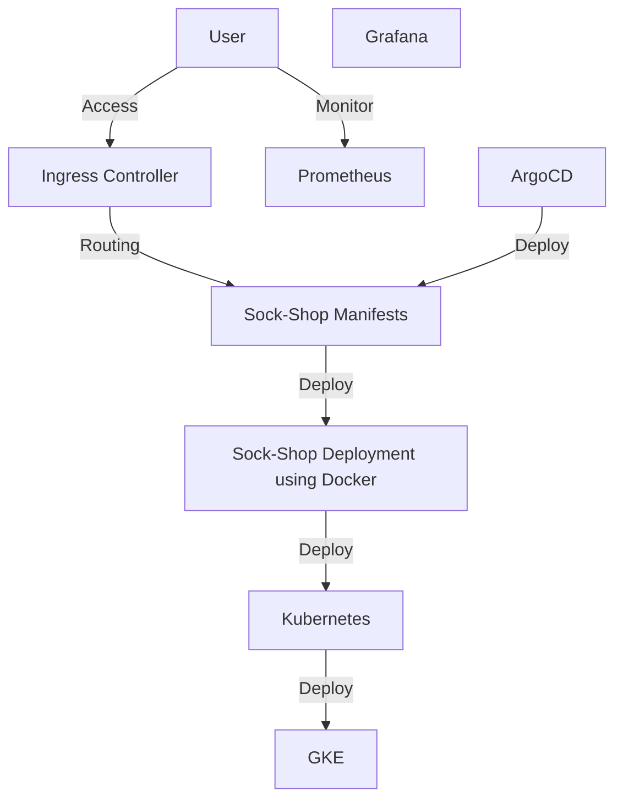

Creating GKE Clusters with Terraform and Deploying Microservices with ArgoCD

Google Kubernetes Engine (GKE) clusters using Terraform and deploying microservices applications with ArgoCD. Terraform will be used to automate the infrastructure setup, while ArgoCD will handle the continuous delivery of microservices to the GKE clusters.

Prerequisites:

Terraform
Google Cloud SDK
kubectl
ArgoCD CLI

- Set Up Google Cloud Platform
Create a new project on Google Cloud Platform.
Enable the GKE API for your project.
Create a service account and download its JSON key. This service account will be used by Terraform to provision resources on GCP.


directory for my sockshop setup 
```
microservice-sockshop/
├── argocd/
│   ├── app.yaml
│   ├── logging.yaml
│   ├── monitoring.yaml
│   └── sockshop.yaml
├── cert-files/
│   ├── cert-man.crd.yaml
│   ├── cert.yaml
│   ├── issuer.yaml
│   └── prodcert.yaml
├── gcp-terraform
├── images/
├── manifest-alerts/
│   ├── AlertManagerConfigmap.yaml
│   ├── AlertTemplateConfigMap.yaml
│   ├── Deployment.yaml
│   └── Service.yaml
├── manifest-logging/
│   ├── es-dep.yaml
│   ├── es-svc.yaml
│   ├── gp3-sc.yaml
│   ├── ingress_rule.yaml
│   ├── es-pv.yaml
│   ├── fluentd.yaml
│   ├── ingress.yaml
│   └── logging-ns.yaml
├── manifest-metrics/
│   ├── cluster-role-binding.yaml
│   ├── deployment.yaml
│   ├── service.yaml
│   ├── cluster-role.yaml
│   └── service-account.yaml
├── manifest-monitoring/
│   ├── README.md
│   ├── grafana-datasource-config.yaml
│   ├── grafana.yaml
│   ├── prometheus-ingress.yaml
│   ├── clusterRole.yaml
│   ├── grafana-deployment.yaml
│   ├── kibana.yaml
│   ├── prometheus-service.yaml
│   ├── config-map.yaml
│   └── prometheus-deployment.yaml
├── manifest-node-exporter/
│   ├── daemonset.yaml
│   └── service.yaml
├── sock-shop/
│   ├── automation/
│   │   └── ...
│   ├── certs/
│   │   └── ...
│   ├── manifests/
│   │   ├── base/
│   │   │   └── ...
│   │   └── overlays/
│   │       ├── multi/
│   │       │   └── ...
│   │       └── single-node-selector/
│   │           └── ...
│   └── guide.md
├── kustomization.yaml
├── readme.md 
```





to begin start by building the infra with terraform 

create or configure terraform
git clone https://github.com/sibylobodoekwe/kubernetes-iaac-microservice
cd microservice-sockshop


create a terraform folder or use my terraform files in gcp-terraform folder, provide the required variables:


`project_id = "your_project_id"
region     = "your_region"
`

Initialize Terraform and download the required plugins.

`terraform init`


- Create GKE Clusters

Apply the Terraform configuration to create the GKE cluster.

`terraform apply --auto-approve`

Review the changes and confirm by typing yes when prompted.

you'd get a similar output 


```
## Outputs

   **Kubernetes Cluster Host:** `34.132.198.125`
   **Kubernetes Cluster Name:** `microservice-417615-gke`
   **Project ID:** `microservice-417615`
    **Region:** `us-central1`
   **Zone:** `us-central1-c`
```


# setting up prometheus
first connect to the kubernetes gke cluster

Connect to your Kubernetes cluster and make sure you have admin privileges to create cluster roles.

run the following commands as you need privileges to create cluster roles for this Prometheus setup.

` ACCOUNT=$(gcloud info --format='value(config.account)')`
`kubectl create clusterrolebinding owner-cluster-admin-binding \`
   ` --clusterrole cluster-admin \`
   ` --user $ACCOUNT `
    


`git clone https://github.com//kubernetes-iaac-microservice/microservice-sockshop`
`cd microservices-sockshop`

`cd manifest-monitoring`

Execute the following command to create a new namespace named monitoring.

`kubectl create namespace monitoring`


open the file named clusterRole.yaml and copy the RBAC role.
role get, list, and watch permissions to nodes, services endpoints, pods, and ingresses. The role binding is bound to the monitoring namespace. If you have any use case to retrieve metrics from any other object, you need to add that in this cluster role.

2 Create the role using the following command.
`kubectl create -f clusterRole.yaml`


Create a file called config-map.yaml and copy the file contents from this link –> Prometheus Config File.

Step 2: Execute the following command to create the config map in Kubernetes.

`kubectl create -f config-map.yaml`

Step 2: Create a deployment on monitoring namespace using the above file.

`kubectl create  -f prometheus-deployment.yaml`
Step 3: You can check the created deployment using the following command.

`kubectl get deployments --namespace=monitoring`
You can also get details from the kubernetes dashboard


Method 1: Using Kubectl port forwarding

Using kubectl port forwarding, you can access a pod from your local workstation using a selected port on your localhost. This method is primarily used for debugging purposes.

Step 1: First, get the Prometheus pod name.

`kubectl get pods --namespace=monitoring`

The output will look like the following.

`kubectl get pods --namespace=monitoring`

NAME                                     READY     STATUS    RESTARTS   AGE
prometheus-monitoring-3331088907-hm5n1   1/1       Running   0          5m
Step 2: Execute the following command with your pod name to access Prometheus from localhost port 8080.


Note: Replace prometheus-monitoring-3331088907-hm5n1 with your pod name.

`kubectl port-forward prometheus-monitoring-3331088907-hm5n1 8080:9090 -n monitoring`

Step 3: Now, if you access http://localhost:8080 on your browser, you will get the Prometheus home page.

Method 2: Exposing Prometheus as a Service [NodePort & LoadBalancer]

To access the Prometheus dashboard over a IP or a DNS name, you need to expose it as a Kubernetes service.

Step 1: Create a file named prometheus-service.yaml and copy the following contents. We will expose Prometheus on all kubernetes node IP’s on port 30000.

Step 2: Create the service using the following command.

`kubectl create -f prometheus-service.yaml --namespace=monitoring`

Step 3: Once created, you can access the Prometheus dashboard using any of the Kubernetes node’s IP on port 30000. If you are on the cloud, make sure you have the right firewall rules to access port 30000 from your workstation.


- Install ArgoCD

Install ArgoCD on the newly created GKE cluster by applying the manifest files:

kubectl apply -n argocd -f https://raw.githubusercontent.com/argoproj/argo-cd/stable/manifests/install.yaml

Verify that ArgoCD resources are created successfully:

kubectl get all -n argocd


- set up your ArgoCD
Access the ArgoCD UI by port-forwarding the service:

kubectl port-forward svc/argocd-server -n argocd 8080:443 

open your web browser and go to https://localhost:8080. Log in using the default username and password.

argocd admin initial-password -n argocd
change the admin password for security reasons:

argocd account update-password


- deploy sock-shop Manifest Files with ArgoCD
the microservices application has Kubernetes manifest files (e.g., deployment, service, ingress) defining each component of the application.
Organize your manifest files into a directory structure that reflects the application's architecture and dependencies.

- create ArgoCD Application: In the ArgoCD UI or via CLI, create a new application. Provide the Git repository URL where your manifest files are located and specify the directory path containing the manifests.
Sync the application after creating the ArgoCD application, Argo will retrieve the manifest files from the repo, compare them with the current state of the cluster, and apply any necessary changes.

- monitoring with Prometheus and Grafana
Deploy Prometheus: Start by deploying Prometheus to your Kubernetes cluster. You can use Helm charts or Kubernetes manifests to install Prometheus. Ensure that Prometheus is configured to scrape metrics from your microservices application.
Deploy Grafana: Next, deploy Grafana to your Kubernetes cluster. Grafana will be used to visualize the metrics collected by Prometheus. Similar to Prometheus, you can use Helm charts or Kubernetes manifests to install Grafana.

- set up domain and Ingress Create DNS Record: In order to access your microservices application from a custom domain, create a DNS record pointing to the IP address of the GKE cluster's load balancer. This can usually be found in the GCP Console under "Networking" > "Network Services" > "Load balancing."


- Ingress Rules define an Ingress resource to route traffic from the specified domain to the appropriate microservice. configure host field of the Ingress resource with your custom domain.

- apply Changes: Apply the changes to your Kubernetes cluster by syncing the ArgoCD application. Argo will detect the updated manifest files and apply the changes accordingly.

- Verify Configuration: Once the changes are applied, verify that the Ingress rules are configured correctly by accessing your microservices application using the custom domain in a web browser. Ensure that the traffic is routed to the correct microservice and that the application functions as expected.
Conclusion

your application wouuld be accessible through you custom domain, and any future updates to the application can be easily managed and deployed using ArgoCD's continuous delivery capabilities. these method would help you  navigate your microservice deployment using ArgoCD on GKE clusters. You can introduce gitlab to your argocd pipeline for continous deployment and repository management.. cc ./argocd-gitlab 


------------------------------------------------I-N------P-R-O-G-R-E-S-S----------------------------------------------------------------------------------
----------------------------------------------------------------------------------------------------------------------------------------------------------